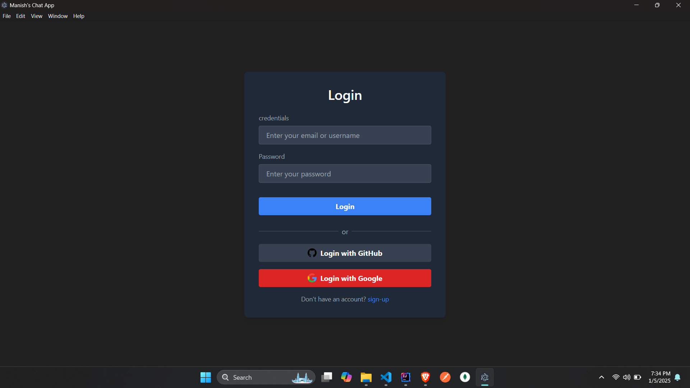
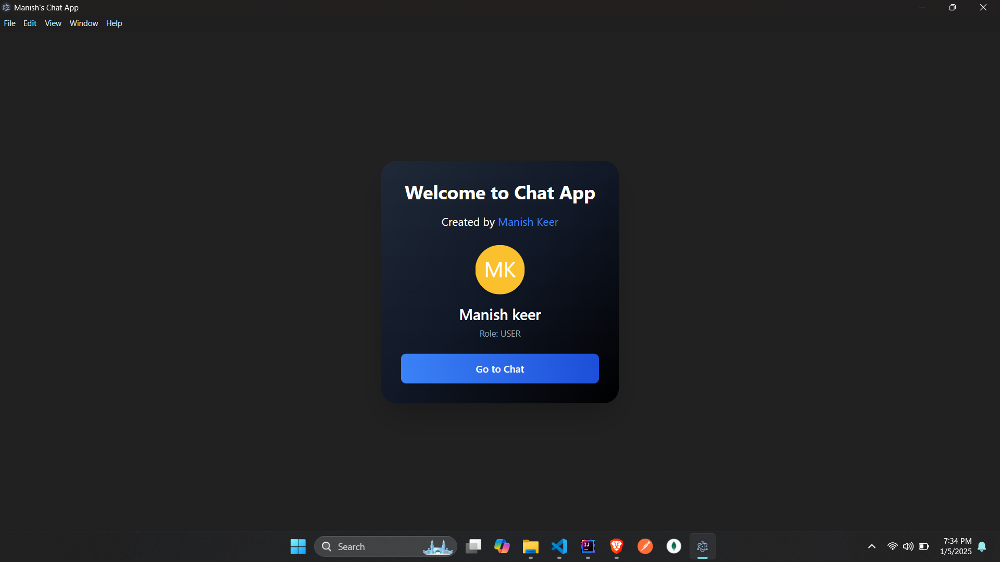
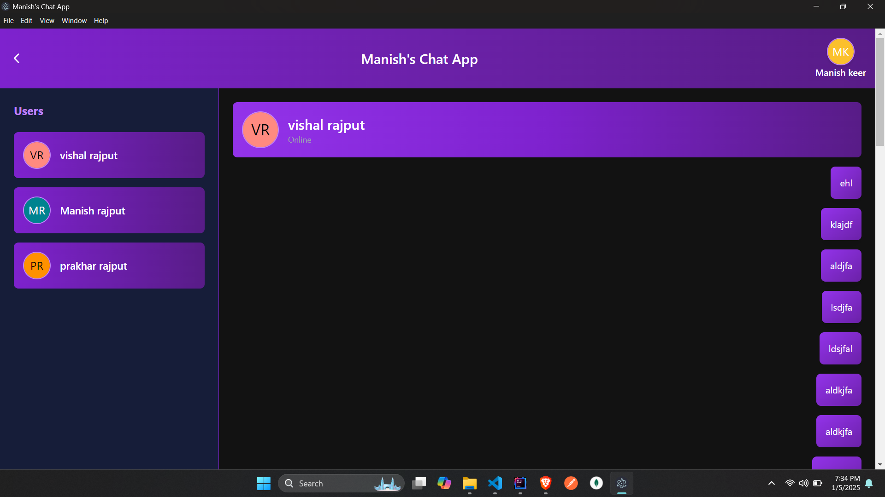
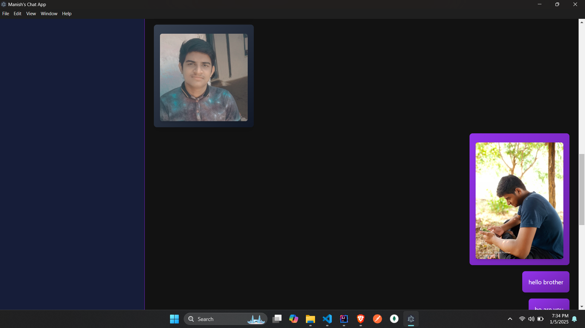

# Chat Application (Desktop & Web Version)

This is a cross-platform chat application built using **Electron.js** for the desktop version, and **React Native** for the mobile version, with a **Spring Boot** backend. The app supports **Windows**, **Linux**, and **Mac** operating systems, and allows users to send messages, share media, and authenticate via **Google** or **GitHub** login using **OAuth2**.

## Features

- **Cross-platform** support: Windows, Linux, and Mac OS
- **OAuth2** login using **Google** and **GitHub**
- **JWT-based authentication** for secure communication
- Media sharing functionality between users
- Real-time messaging and notifications
- User-friendly and responsive UI design
- Built with **MongoDB** for efficient data storage
- Fast development with **Vite**

## Technologies Used

- **Frontend (Desktop)**: Electron.js
- **Frontend (Mobile)**: React Native (No Expo)
- **Backend**: Spring Boot
- **Authentication**: OAuth2 (Google/GitHub login), JWT-based security
- **Database**: MongoDB
- **Development Tools**: Vite for fast build and development

## Installation

### Prerequisites

- **Node.js** (version 16 or later)
- **MongoDB** (locally or MongoDB Atlas)
- **Java** (version 11 or later)
- **Spring Boot** (for backend)
- **Electron.js** (for desktop application)
- **React Native** (for mobile application)

### Backend Setup (Spring Boot)

1. Clone the repository:
    ```bash
    git clone https://github.com/yourusername/chat-application.git
    ```

2. Navigate to the backend folder:
    ```bash
    cd chat-application/backend
    ```

3. Install dependencies and run the Spring Boot application:
    ```bash
    ./mvnw spring-boot:run
    ```

### Frontend Setup (Desktop)

1. Navigate to the desktop app folder:
    ```bash
    cd chat-application/desktop
    ```

2. Install dependencies:
    ```bash
    npm install
    ```

3. Run the Electron app:
    ```bash
    npm start
    ```

### Frontend Setup (Mobile)

1. Navigate to the mobile app folder:
    ```bash
    cd chat-application/mobile
    ```

2. Install dependencies:
    ```bash
    npm install
    ```

3. Run the app on an emulator or a real device:
    ```bash
    npx react-native run-android
    ```
    or
    ```bash
    npx react-native run-ios
    ```

## Screenshots

Here are some screenshots of the app in action:







## Acknowledgements

- **Electron.js** for creating cross-platform desktop applications
- **React Native** for building mobile apps
- **Spring Boot** for the backend framework
- **MongoDB** for data storage
- **OAuth2** for authentication security
- **JWT** for secure communication

